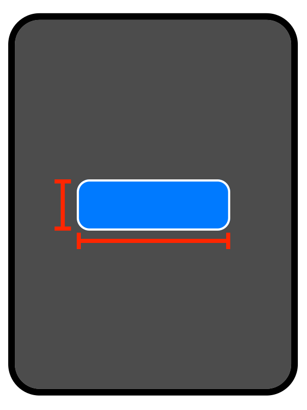
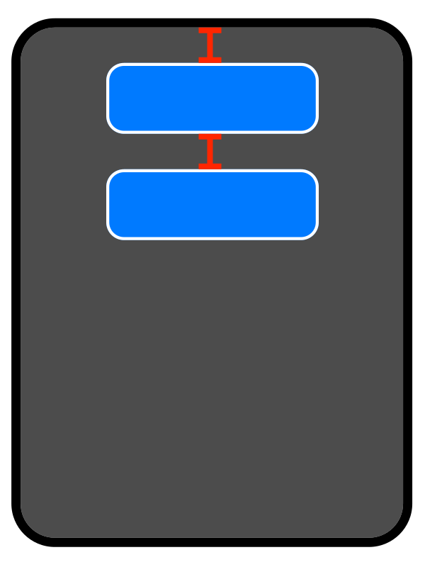

# Hamcrest AutoLayout Matchers

This frameworks contains [Hamcrest](https://github.com/nschum/SwiftHamcrest) matchers to verify auto layout constraints.

Example:

```
func test_height_matcher() {
	// given
	first.heightAnchor.constraint(equalToConstant: 44.0).isActive = true
		
	// expect
	assertThat(first, hasHeight(of: 44))
}
``` 

## Center and Size



```swift
assertThat(view, isVerticalCenter())
assertThat(view, isHorizontalCenter())
// or
assertThat(view, isCenter())

assertThat(view, hasWidth(of:150))
assertThat(view, hasHeight(of:44))


```

## Pinned


```swift
assertThat(view, isPinned(.top, gap: 20))
assertThat(view, isPinned(.left, gap: 20))
assertThat(view, isPinned(.right, gap: 20))
assertThat(view, isPinned(.bottom, gap: 20))
// or
assertThat(view, isPinned(.leading, gap: 20))
assertThat(view, isPinned(.trailing, gap: 20))

// isPinned(<NSLayoutConstraint.Attribute>)
```

## Pinned to other



```swift
assertThat(first, isPinned(.top, gap: 20))
assertThat(first, isVerticalCenter())
//assertThat(first, hasWidth(of:150))
//assertThat(first, hasHeight(of:44))

assertThat(second, hasSameWidthAs(first))
assertThat(second, hasSameHeightAs(first))
assertThat(second, isVerticalCenter())
assertThat(second, isPinned(.top, toView: first, gap: 20))

```

### Save Area

```swift
// Safe area
assertThat(view, isPinnedToSafeAreaAnchor(.top))

// Readable Anchor
assertThat(view, isPinnedToReadableAnchor(.leading))
```

